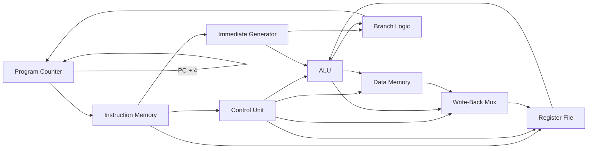

# RISC-V Single-Cycle Core → Crypto-RV (Cryptographic RISC-V Processor)

> A custom single-cycle RISC-V processor implemented in Verilog, built as a foundation for a future hardware-accelerated cryptographic processor.

[](#license)
[](#technologies-used)
[-orange.svg)](#instruction-set)
[](#roadmap)

---

## Table of Contents

- [Project Description](#project-description)
- [Features](#features)
- [Architecture Overview](#architecture-overview)
- [Instruction Set](#instruction-set)
- [Folder Structure](#folder-structure)
- [Getting Started](#getting-started)
- [Running the Simulation](#running-the-simulation)
- [Testing the Processor](#testing-the-processor)
- [FPGA Deployment](#fpga-deployment)
- [Performance](#performance)
- [Roadmap](#roadmap)
- [Future Work](#future-work)
- [Technologies Used](#technologies-used)
- [Contributing](#contributing)
- [License](#license)
- [Acknowledgments](#acknowledgments)

---

## Project Description

This repository contains a **custom single-cycle RISC-V processor** written in Verilog, designed from the ground up as both a learning vehicle for computer architecture and a foundation for a longer-term goal: a **cryptography-oriented RISC-V processor** with dedicated hardware acceleration for cryptographic primitives.

### Motivation

Modern embedded and IoT systems increasingly depend on cryptographic operations — encryption, hashing, and secure boot — that are often computationally expensive when handled purely in software. General-purpose processors executing these algorithms in software incur significant performance and power overhead compared to hardware-accelerated implementations. This project was started to:

1. Build a solid, well-understood RISC-V core from first principles (control path, datapath, memory interfacing, and instruction execution).
2. Use that core as a base for exploring **custom ISA extensions** and **dedicated hardware accelerators** for common cryptographic algorithms (e.g., AES, SHA).
3. Serve as a practical, hands-on demonstration of digital design, computer architecture, and FPGA development skills.

### Long-Term Vision

The single-cycle core in this repository is the **first milestone** in a multi-stage roadmap:

```
Single-Cycle Core  →  Pipelined Core  →  Custom Crypto Extensions  →  Hardware-Accelerated Crypto RISC-V
```

The end goal is a RISC-V processor capable of offloading cryptographic workloads to dedicated hardware blocks integrated directly into the core or attached as memory-mapped coprocessors, while remaining a fully functional, general-purpose RV32I processor.

> **Note:** This is an evolving project. Sections marked with **TODO** or **Verify this section** should be updated as the implementation progresses.

---

## Features

| Feature | Status |
|---|---|
| Single-cycle datapath | ✅ Implemented |
| Verilog HDL implementation | ✅ Implemented |
| RV32I base instruction set support | ⚠️ **Assumption — verify against actual implemented opcodes** |
| Modular RTL design (separated functional blocks) | ⚠️ **Assumption — verify module boundaries in `rtl/`** |
| Testbench-based simulation support | ⚠️ **Assumption — confirm testbench coverage** |
| FPGA-ready synthesis | ⚠️ **TODO — confirm target board and synthesis results** |
| Extensible architecture for future ISA extensions | ✅ Design goal |
| Planned cryptographic hardware acceleration | 🔜 Future work |

> **Verify this section:** Confirm which RV32I instructions are actually implemented and update the [Instruction Set](#instruction-set) table accordingly.

---

## Architecture Overview

The processor follows a classic **single-cycle RISC-V datapath**, where every instruction completes fetch, decode, execute, memory access, and write-back within a single clock cycle.

### Core Components

- **Program Counter (PC):** Holds the address of the current instruction and updates each cycle based on sequential execution or branch/jump resolution.
- **Instruction Memory:** Read-only memory that supplies the 32-bit instruction word corresponding to the current PC value.
- **Control Unit:** Decodes the instruction opcode (and `funct3`/`funct7` fields, where applicable) to generate control signals that drive the ALU, register file, memory, and write-back multiplexers.
- **Register File:** A 32×32-bit general-purpose register array (`x0`–`x31`) supporting two simultaneous reads and one write per cycle, with `x0` hardwired to zero.
- **Immediate Generator:** Extracts and sign-extends immediate values from the instruction encoding, supporting I-type, S-type, B-type, U-type, and J-type formats.
- **ALU (Arithmetic Logic Unit):** Executes arithmetic, logical, and comparison operations required by R-type, I-type, and branch instructions.
- **Branch Logic:** Evaluates branch conditions (equality, comparison) and computes the next PC for taken branches and jumps.
- **Data Memory:** Read/write memory interface for load and store instructions.
- **Write-Back Stage:** Selects the value (ALU result, memory data, or PC+4) to be written back into the register file.

> **Verify this section:** Confirm exact module names and signal-level interfaces against the RTL in `rtl/` and update this description accordingly.

### Datapath Diagram



> **Note:** This diagram represents the conceptual single-cycle datapath. Update it once exact signal names and module hierarchy from the RTL are finalized.

---

## Instruction Set

The table below lists the RV32I instructions expected to be supported by a typical single-cycle implementation. **This is a placeholder — verify against the actual decoded opcodes in the Control Unit and update accordingly.**

| Instruction | Type | Format | Description |
|---|---|---|---|
| `ADD`, `SUB` | R-type | `funct7 rs2 rs1 funct3 rd opcode` | Register-register arithmetic |
| `AND`, `OR`, `XOR` | R-type | R-type | Bitwise logical operations |
| `SLL`, `SRL`, `SRA` | R-type | R-type | Shift operations |
| `SLT`, `SLTU` | R-type | R-type | Set-less-than comparisons |
| `ADDI`, `ANDI`, `ORI`, `XORI` | I-type | I-type | Immediate arithmetic/logical |
| `SLTI`, `SLTIU` | I-type | I-type | Immediate comparisons |
| `LW`, `LH`, `LB`, `LHU`, `LBU` | I-type (Load) | I-type | Load from memory |
| `SW`, `SH`, `SB` | S-type (Store) | S-type | Store to memory |
| `BEQ`, `BNE`, `BLT`, `BGE`, `BLTU`, `BGEU` | B-type | B-type | Conditional branches |
| `JAL` | J-type | J-type | Jump and link |
| `JALR` | I-type | I-type | Jump and link register |
| `LUI` | U-type | U-type | Load upper immediate |
| `AUIPC` | U-type | U-type | Add upper immediate to PC |

> ⚠️ **TODO:** Replace this table with the actual instruction subset supported by the current implementation, including any unsupported or partially implemented instructions.

---

## Folder Structure

```
project/
├── rtl/               # Verilog source files (core modules)
├── testbench/          # Testbenches for simulation and verification
├── docs/                # Additional documentation, notes, and diagrams
├── simulations/     # Simulation scripts and output logs
├── waveforms/       # Saved waveform files (.vcd, .fst, etc.)
├── images/             # Diagrams, screenshots, and figures used in docs
└── README.md
```

> **Verify this section:** Update the tree above to match the actual repository layout, and add/remove directories as needed (e.g., `constraints/`, `synthesis/`, `scripts/`).

---

## Getting Started

### Prerequisites

**Simulation tools** (at least one required):

- [Icarus Verilog](http://iverilog.icarus.com/) — open-source Verilog simulator
- [GTKWave](http://gtkwave.sourceforge.net/) — waveform viewer
- [ModelSim](https://www.intel.com/content/www/us/en/software-kit/750368/modelsim-intel-fpgas-standard-edition-software-version-20-1.html) — alternative simulator (optional)

**FPGA toolchains** (only required for hardware deployment):

- [Xilinx Vivado](https://www.xilinx.com/products/design-tools/vivado.html) — for Xilinx FPGA targets
- [Intel Quartus Prime](https://www.intel.com/content/www/us/en/software/programmable/quartus-prime/overview.html) — for Intel FPGA targets

> ⚠️ **TODO:** Specify the exact FPGA board(s) targeted (e.g., Basys 3, Nexys A7, DE10-Lite) once hardware deployment is finalized.

### Installation

```bash
# Clone the repository
git clone https://github.com/<your-username>/<your-repo-name>.git
cd <your-repo-name>

# (Optional) Install Icarus Verilog on Debian/Ubuntu
sudo apt-get install iverilog gtkwave
```

---

## Running the Simulation

1. **Compile the design and testbench:**

   ```bash
   iverilog -o sim_out rtl/*.v testbench/tb_top.v
   ```

2. **Run the simulation:**

   ```bash
   vvp sim_out
   ```

3. **View waveforms:**

   ```bash
   gtkwave waveform.vcd
   ```

4. **Expected output:**

   The simulation should print register/memory state changes to the console (if implemented) and generate a `.vcd` waveform file for inspection in GTKWave.

> ⚠️ **TODO:** Replace file names (`tb_top.v`, `waveform.vcd`) with the actual testbench and dump file names used in this repository.

---

## Testing the Processor

This section outlines a general methodology for verifying correct processor behavior. **Adapt these steps to match the actual testbench structure in `testbench/`.**

### 1. Writing a Testbench

- Instantiate the top-level processor module.
- Generate a clock signal using an `always` block (e.g., toggle every 5 ns for a 10 ns period).
- Apply a reset sequence at the start of simulation to initialize all registers and the PC to a known state.

### 2. Loading Instruction Memory

- Use `$readmemh` or `$readmemb` to preload the instruction memory with a hex/binary machine-code file.
- Ensure the instruction memory module correctly maps addresses to instruction words.

### 3. Initializing Registers

- Confirm `x0` is hardwired to zero.
- Optionally preload specific registers via testbench force statements for isolated unit testing.

### 4. Verifying ALU Operations

- Apply known operand pairs and opcodes.
- Compare ALU output against expected results using `$display` or assertion macros.

### 5. Testing Branching

- Write test programs exercising each branch instruction (`BEQ`, `BNE`, `BLT`, etc.) with both taken and not-taken conditions.
- Verify the PC updates correctly in each case.

### 6. Validating Memory Operations

- Test `LW`/`SW` (and byte/halfword variants) with various addresses and data patterns.
- Confirm data is stored and retrieved correctly, including alignment handling if applicable.

### 7. Verifying Overall Instruction Execution

- Run small assembled test programs (e.g., Fibonacci, sorting) and check final register/memory state against expected values.

### 8. Inspecting Signals with Waveform Viewers

- Add `$dumpfile` and `$dumpvars` calls to your testbench.
- Open the resulting `.vcd` file in GTKWave to inspect PC, control signals, ALU inputs/outputs, and register file writes cycle-by-cycle.

### 9. Debugging Common Issues

| Symptom | Possible Cause |
|---|---|
| PC does not increment | Reset held too long, or PC update logic error |
| Wrong ALU result | Incorrect `funct3`/`funct7` decoding in Control Unit |
| Branch always/never taken | Comparator logic or condition signal wired incorrectly |
| Register writes don't persist | Write-enable signal not asserted, or clock edge mismatch |
| Memory read returns garbage | Address decoding error or uninitialized memory |

> **Verify this section:** Update with project-specific debugging notes as issues are encountered and resolved.

---

## FPGA Deployment

> ⚠️ **This project has not yet been deployed to FPGA hardware — FPGA deployment is planned future work.**

Once hardware deployment is implemented, this section should cover:

1. **Synthesis** — Running RTL synthesis in Vivado or Quartus and reviewing timing/utilization reports.
2. **Bitstream Generation** — Generating the `.bit` (Xilinx) or `.sof`/`.pof` (Intel) programming file.
3. **Programming the FPGA** — Loading the bitstream onto the target board via JTAG or a vendor-specific programmer.
4. **Hardware Testing** — Verifying processor behavior on real hardware using LEDs, switches, UART output, or an on-board debugger.

---

## Performance

| Metric | Value |
|---|---|
| Architecture | Single-cycle |
| Clock frequency | **TODO — measure after synthesis/timing analysis** |
| CPI (Cycles per Instruction) | 1 (by design, single-cycle) |
| Critical path | **TODO — determined by longest combinational path (typically memory + ALU + write-back)** |
| LUT/FF utilization | **TODO — populate after FPGA synthesis report** |
| Power estimate | **TODO — populate after implementation** |

### Design Trade-offs

Single-cycle designs favor **simplicity and ease of verification** over clock speed: every instruction takes exactly one (long) clock cycle, sized to accommodate the slowest instruction path. This makes the design an excellent teaching and prototyping platform, but it is not optimized for maximum throughput — a natural next step is a pipelined implementation (see [Roadmap](#roadmap)).

---

## Roadmap

### ✅ Completed

- [x] Single-cycle RISC-V core
- [x] Register file
- [x] ALU
- [x] Control unit
- [x] Immediate generator
- [x] Basic instruction memory and data memory interfaces

### 🚧 In Progress

- [ ] Pipelined datapath (5-stage or similar)
- [ ] Expanded testbench coverage and automated regression testing
- [ ] Hazard detection and forwarding (pipeline-dependent)

### 🔮 Future

- [ ] Cryptographic hardware accelerator module(s)
- [ ] AES hardware acceleration unit
- [ ] SHA (secure hash) accelerator
- [ ] Secure boot support
- [ ] Custom ISA extensions for cryptographic instructions
- [ ] Performance optimization and timing closure
- [ ] FPGA benchmarking and resource utilization reports

---

## Future Work

The long-term goal of this project is to evolve from a general-purpose RV32I core into a **cryptography-focused RISC-V processor**. Planned directions include:

- **Custom ISA Extensions:** Defining custom opcodes (within the RISC-V custom-instruction encoding space) for cryptographic primitives such as AES round functions, SHA compression, and modular arithmetic used in public-key cryptography.
- **Dedicated Hardware Accelerators:** Implementing AES and SHA as either tightly-coupled functional units within the core or as memory-mapped coprocessors accessible via custom instructions or a simple bus interface.
- **Secure Boot:** Exploring a hardware root-of-trust and secure boot sequence leveraging the cryptographic accelerators.
- **Side-Channel Considerations:** Investigating basic countermeasures against timing and power side-channel leakage in the cryptographic datapath (a natural extension of hardware-accelerated crypto).
- **Pipelining:** Migrating from single-cycle to a pipelined microarchitecture to improve throughput, which will also apply to the crypto-accelerated instructions.

> **Note:** These are design goals and research directions, not yet implemented. This section will be updated as development progresses.

---

## Technologies Used

- **Verilog HDL** — RTL design language
- **RISC-V ISA (RV32I)** — Instruction set architecture
- **FPGA** — Target deployment platform (**TODO: specify vendor/board**)
- **Digital Logic Design** — Core design methodology
- **Computer Architecture** — Datapath and control design principles
- **Simulation Tools** — Icarus Verilog, GTKWave (**TODO: confirm/add ModelSim, Verilator, etc. if used**)

---

## Contributing

Contributions, issues, and feature requests are welcome! This project is under active development, and feedback from the FPGA and computer architecture community is highly valued.

1. **Fork** the repository.
2. **Create a feature branch:**
   ```bash
   git checkout -b feature/your-feature-name
   ```
3. **Commit your changes** with clear, descriptive commit messages.
4. **Add or update tests** in `testbench/` for any new functionality.
5. **Ensure simulations pass** before submitting.
6. **Open a Pull Request** describing the change, motivation, and any relevant test results or waveform screenshots.

Please open an issue first for significant architectural changes (e.g., new instructions, pipeline modifications) to discuss the approach before implementation.

---

## License

> ⚠️ **TODO:** No license has been selected yet. Consider adding an open-source license such as [MIT](https://choosealicense.com/licenses/mit/), [Apache 2.0](https://choosealicense.com/licenses/apache-2.0/), or [BSD-3-Clause](https://choosealicense.com/licenses/bsd-3-clause/) to clarify usage rights for contributors and users.

---

## Acknowledgments

- The [RISC-V Foundation](https://riscv.org/) for the open, extensible instruction set architecture that made this project possible.
- The open-source hardware community for tools such as Icarus Verilog and GTKWave that make independent FPGA/HDL development accessible.
- Course materials, textbooks, and reference designs that informed the single-cycle architecture (**TODO: cite specific references, e.g., "Digital Design and Computer Architecture: RISC-V Edition" by Harris & Harris, if used**).

---

<div align="center">

**Built as part of an ongoing journey into computer architecture, FPGA design, and hardware security.**

</div>
